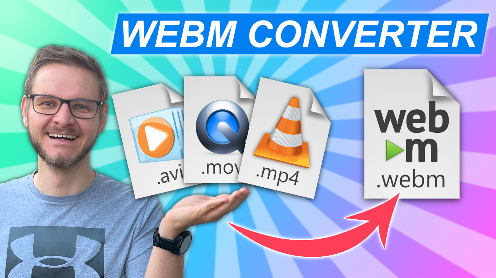

# WebM Converter

Follow me:  |  |  |  

Inspired by [nuttylamo's](https://github.com/nuttylmao) [Batch script](https://github.com/nuttylmao/Nutty-s-WebM-Converter) for converting video files to WebM files.

## Video

<a href="https://youtu.be/dt3BKlOYaVQ">
    
</a>

[Youtube Video Link](https://youtu.be/dt3BKlOYaVQ)


## Run

Download latest release uns zip and run the `webm_converter.exe` inside `webm_converter` folder.

## Bundle with PyInstaller (Windows only)

```
python3 -m pip install -r requirements.txt
python3 -m pip install pyinstaller
python3 -m PyInstaller --noconfirm webm_converter.spec
```

## Credits
 Created by Konstantin (Konze) Lübeck

 * Twitch: [twitch.tv/k0nze](https://twitch.tv/k0nze) 
 * Youtube: [youtube.com/k0nze](https://youtube.com/k0nze) 
 * Patreon: [patreon.com/k0nze](https://patreon.com/k0nze) 
 * Discord: [discord.k0nze.gg](https://discord.k0nze.gg) 
 * Twitter: [twitter.com/k0nze_gg](https://twitter.com/k0nze_gg)
 * TikTok: [tiktok.com/@k0nze.gg](https://tiktok.com/@k0nze.gg) 

